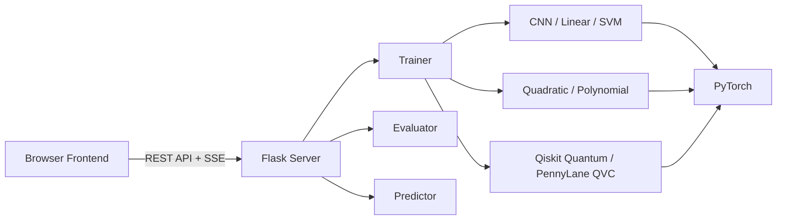

# Multi-Dataset Classifier Platform


A full-stack web application for training, evaluating, and comparing classical and quantum-hybrid neural network classifiers across multiple datasets. Containerized with Docker and served via Flask.

> **Note on naming:** The repository directory may still appear as `quantum-protein-kernel` in some contexts — this is a historical artifact. The project is a general-purpose multi-dataset classifier platform (package name: `quantum-machine-learning`). No protein or bioinformatics data is used.

Ships with **MNIST** (handwritten digit recognition via canvas drawing) and **Iris** (flower species classification via numeric features), and is designed so adding a new dataset requires zero changes to existing code.


## Architecture



---

## Features

### Core
- **Plugin architecture** — each dataset is a self-contained plugin; add new ones without modifying any shared code
- **Multiple model architectures per dataset** — CNN, Linear, SVM, Quadratic, Polynomial, and Qiskit quantum models for MNIST; Linear, SVM, and PennyLane QVC for Iris
- **Live training progress** via Server-Sent Events — watch loss and epoch updates as they stream in
- **Training curves** — real-time loss and validation accuracy charts rendered on a canvas during training
- **Auto-evaluation** — test-set accuracy, per-class accuracy, and parameter counts computed automatically
- **Multi-model comparison** — train as many models as you like and compare metrics side-by-side
- **Draw-to-predict** (MNIST) — freehand canvas with auto-predict on pen lift
- **Form-to-predict** (Iris) — enter sepal/petal measurements and predict species
- **Model persistence** — export trained models to `.pt` checkpoint files (including training history) and re-import them across sessions

### Advanced Training
- **Early stopping** — halt training when validation accuracy stops improving (configurable patience)
- **Validation monitoring** — periodic validation accuracy checks during training (configurable frequency)
- **Knowledge distillation** — train a student model using a previously trained teacher's soft outputs
- **Custom regularization** — pluggable regularization functions via `TrainingConfig`

### Advanced Evaluation
- **Ensemble evaluation** — majority-vote ensemble across multiple models with logit-based tie-breaking
- **Ablation study** — zero out each layer's parameters and measure the accuracy drop, streamed via SSE
- **Parameter counting** — automatic trainable parameter counts displayed in the comparison table

### UI
- **Dark / light theme** — toggle with one click, persisted in `localStorage`
- **Resizable split layout** — drag to adjust the column ratio; width is persisted across sessions
- **Smart naming** — defaults to the bare model type (`"CNN"`), only appends a number if that name is already taken
- **Tooltips** — contextual help on form labels and action buttons

---

## Quick Start

### Docker (recommended)

```bash
git clone https://github.com/andypeterson2/quantum-machine-learning.git
cd quantum-machine-learning
docker compose up --build
```

Open `http://localhost:5001` in your browser.

### Local

#### 1. Install dependencies

```bash
pip install torch torchvision flask pillow numpy scikit-learn
```

Or with conda:

```bash
conda install pytorch torchvision scikit-learn -c pytorch
pip install flask pillow
```

**Optional** — for Qiskit quantum model architectures:

```bash
pip install qiskit qiskit-aer
```

### 2. Run the server

```bash
python -m classifiers
```

The app starts at **http://localhost:5001** and redirects to `/d/mnist/`.
MNIST data is downloaded automatically to `./data/` on first run (~11 MB).
Iris data is loaded from scikit-learn (bundled, no download needed).

### 3. Train a model

1. Select a **Model** type from the dropdown
2. Adjust **Epochs**, **Batch Size**, and **Learning Rate** as needed
3. Give the model a **name** (or leave blank for smart auto-naming)
4. *(Optional)* Expand **Advanced** to configure early stopping, validation frequency, or knowledge distillation
5. Click **Train**

Training streams live epoch/loss updates to the LOG panel and renders training curves in real time. When complete, the test set is evaluated automatically and results fill the comparison table.

### 4. Switch datasets

Click the **hamburger menu** in the top-right corner to switch between MNIST, Iris, or any other registered dataset.

### 5. Predict

- **MNIST**: Draw a digit (0-9) on the canvas — predictions fire automatically on pen lift
- **Iris**: Enter four measurements (sepal length/width, petal length/width) and click **Predict**

### 6. Ensemble & Ablation

- **Ensemble**: When 2+ models are trained, click **Ensemble** to run majority-vote ensemble evaluation
- **Ablation**: Click the ablation button on any model to measure each layer's contribution to accuracy

### 7. Save and load models

- Click the save icon next to any session model to export it as a `.pt` file to the `models/` folder
- Use the **Saved Models** dropdown in the MODELS card to import previously saved checkpoints

---

## Project Layout

```
quantum-protein-kernel/
├── classifiers/                    # Application package
│   ├── __init__.py                 # Package docstring
│   ├── __main__.py                 # Entry point  (python -m classifiers)
│   ├── server.py                   # Flask app factory + DI setup
│   ├── dataset_plugin.py           # DatasetPlugin ABC (the OCP extension point)
│   ├── plugin_registry.py          # Plugin discovery + registration
│   ├── base_model.py               # BaseModel ABC (forward + loss_fn)
│   ├── trainer.py                  # Training loop (early stopping, distillation, history)
│   ├── training_config.py          # TrainingConfig + HistoryEntry dataclasses
│   ├── evaluator.py                # Evaluation (single, ensemble, ablation)
│   ├── predictor.py                # Inference pipeline (raw input → probabilities)
│   ├── model_registry.py           # In-memory model store, namespaced by dataset
│   ├── persistence.py              # Disk I/O for .pt checkpoint files
│   ├── losses.py                   # Shared loss functions (hinge loss)
│   ├── layers.py                   # Reusable layers (Quadratic, Polynomial)
│   ├── qiskit_layers.py            # Qiskit quantum circuit layer (optional dep)
│   ├── types.py                    # Shared types (StatusCallback, TrainingEvent)
│   ├── routes/
│   │   ├── __init__.py             # Blueprint registration
│   │   ├── main.py                 # GET / (redirect), GET /api/datasets
│   │   ├── dataset_routes.py       # Blueprint shell, hooks, page route
│   │   ├── train_routes.py         # POST /train endpoint
│   │   ├── eval_routes.py          # POST /evaluate, /ensemble, /ablation endpoints
│   │   ├── model_routes.py         # POST /predict, GET /models, DELETE, export, disk
│   │   ├── errors.py               # Centralized error_response() helper
│   │   └── sse.py                  # SSE streaming helpers
│   ├── datasets/
│   │   ├── __init__.py             # Auto-discovery trigger
│   │   ├── mnist/
│   │   │   ├── __init__.py         # Register MNISTPlugin
│   │   │   ├── plugin.py           # MNISTPlugin (loaders, preprocessing, config)
│   │   │   └── models.py           # MNISTNet, LinearNet, SVMNet, Quadratic,
│   │   │                           #   Polynomial, QiskitCNN, QiskitLinear
│   │   └── iris/
│   │       ├── __init__.py         # Register IrisPlugin
│   │       ├── plugin.py           # IrisPlugin (sklearn data, standardisation)
│   │       └── models.py           # IrisLinear, IrisSVM
│   ├── templates/
│   │   └── index.html              # Single-page UI (Jinja2)
│   └── static/
│       ├── css/app.css             # Theming, layout, chart styles
│       ├── js/
│       │   ├── app.js              # Canvas, state management, tables, UI logic
│       │   ├── sse.js              # SSE stream consumer (consumeSSE)
│       │   └── chart.js            # Canvas-based training curve renderer
│       └── ui-kit/                 # Shared UI component library
├── tests/                          # Pytest test suite (142 tests)
├── models/                         # Saved .pt checkpoints (git-ignored)
└── data/                           # Dataset cache (git-ignored)
```

---

## Architecture & Design Principles

The codebase follows all five [SOLID](https://en.wikipedia.org/wiki/SOLID) principles:

### Single Responsibility (SRP)

Each module has one clear job:

| Module | Responsibility |
|--------|---------------|
| `trainer.py` | Training loop only — no data loading, no evaluation |
| `training_config.py` | Training configuration dataclasses — no logic |
| `evaluator.py` | Test-set metrics only — no training, no I/O |
| `predictor.py` | Single-sample inference only — delegates preprocessing to the plugin |
| `model_registry.py` | In-memory model storage — no file I/O |
| `persistence.py` | Disk checkpoint I/O — no in-memory state |
| `layers.py` | Reusable neural network layers — no model assembly |
| `train_routes.py` | HTTP orchestration for training — delegates to `Trainer` |
| `eval_routes.py` | HTTP orchestration for evaluation — delegates to `Evaluator` |
| `model_routes.py` | HTTP orchestration for model CRUD — delegates to registry/persistence |
| `errors.py` | Consistent JSON error response formatting |
| `sse.js` | SSE transport only — no business logic |
| `chart.js` | Chart rendering only — no data fetching |

### Open/Closed (OCP)

The `DatasetPlugin` ABC is the sole extension point. Adding a new dataset (e.g. Fashion-MNIST, CIFAR-10) means creating a new subpackage under `classifiers/datasets/` — **zero changes to any existing file**. Auto-discovery (`pkgutil.walk_packages`) finds and registers it at startup.

Similarly, new model architectures are added by defining a `BaseModel` subclass and registering it in the plugin's `get_model_types()` — the trainer, evaluator, and routes handle them automatically.

### Liskov Substitution (LSP)

All `DatasetPlugin` subclasses and all `BaseModel` subclasses are fully interchangeable. The shared infrastructure (trainer, evaluator, predictor, routes) works identically regardless of which concrete plugin or model is active. Models can override `loss_fn()` (e.g. SVM uses hinge loss instead of cross-entropy) without breaking any consumer.

### Interface Segregation (ISP)

- `BaseModel` exposes only `forward()` and `loss_fn()` — no training or evaluation methods
- `DatasetPlugin` groups only dataset-specific concerns — no route handling or persistence logic
- `StatusCallback` is a minimal single-method type alias, not a heavy interface
- `TrainingEvent` is a lightweight Protocol for structured SSE events
- `TrainingConfig` is an opt-in dataclass — when `None`, the trainer behaves identically to its original simple loop

### Dependency Inversion (DIP)

Route handlers never import concrete services directly. Instead, shared services (`ModelRegistry`, `ModelPersistence`) are attached to `app.extensions` during factory setup and accessed via `current_app.extensions[...]` at request time. This makes each component independently testable and replaceable.

The trainer depends on the `DataLoader` abstraction (not concrete dataset libraries), and the evaluator depends on `BaseModel` (not specific architectures). Qiskit is lazy-imported only when a quantum model is instantiated — the rest of the codebase has no awareness of it.

---

## Adding a New Dataset

To add a third dataset (e.g. Fashion-MNIST), create a subpackage:

```
classifiers/datasets/fashion_mnist/
├── __init__.py       # 2 lines: import + register_plugin()
├── plugin.py         # FashionMNISTPlugin(DatasetPlugin)
└── models.py         # Model architectures for this dataset
```

### `__init__.py`

```python
from classifiers.plugin_registry import register_plugin
from .plugin import FashionMNISTPlugin

register_plugin(FashionMNISTPlugin())
```

### `plugin.py`

```python
from classifiers.dataset_plugin import DatasetPlugin

class FashionMNISTPlugin(DatasetPlugin):
    name = "fashion_mnist"
    display_name = "Fashion-MNIST"
    input_type = "image"
    num_classes = 10
    class_labels = ["T-shirt", "Trouser", "Pullover", "Dress", "Coat",
                    "Sandal", "Shirt", "Sneaker", "Bag", "Ankle boot"]
    image_size = (28, 28)
    image_channels = 1

    def get_train_loader(self, batch_size): ...
    def get_test_loader(self, batch_size): ...
    def get_val_loader(self, batch_size): ...   # Optional: enables early stopping
    def preprocess(self, raw_input): ...
    def get_model_types(self): ...
```

That's it. No changes to any existing file. The new dataset appears automatically in the hamburger menu, with its own scoped routes, models, and UI configuration.

---

## API Reference

All dataset-scoped endpoints live under `/d/<dataset>/`:

| Method | Path | Body | Response |
|--------|------|------|----------|
| `GET` | `/` | — | 302 redirect → `/d/mnist/` |
| `GET` | `/api/datasets` | — | `[{name, display_name, input_type}, ...]` |
| `GET` | `/d/<dataset>/` | — | `index.html` (rendered for that dataset) |
| `POST` | `/d/<dataset>/train` | `{model_type, epochs, batch_size, lr, name, patience?, val_gap?, teacher?, distill_weight?}` | SSE stream |
| `POST` | `/d/<dataset>/evaluate` | `{}` | SSE stream |
| `POST` | `/d/<dataset>/ensemble` | `{model_names: ["Model 1", "Model 2", ...]}` | JSON result |
| `POST` | `/d/<dataset>/ablation` | `{model_name: "Model 1"}` | SSE stream |
| `POST` | `/d/<dataset>/predict` | `{image: "<b64>"}` or `{features: {...}}` | `{results: {name: {prediction, confidence, probs}}}` |
| `GET` | `/d/<dataset>/models` | — | `{name: {model_type, epochs, ..., eval_result}}` |
| `DELETE` | `/d/<dataset>/models/<name>` | — | `{ok: true}` |
| `POST` | `/d/<dataset>/models/<name>/export` | — | `{ok: true, filename}` |
| `GET` | `/d/<dataset>/models/disk` | — | `[{filename, name, model_type, ...}]` |
| `POST` | `/d/<dataset>/models/disk/<fn>/load` | — | `{ok: true, name, model_type, ...}` |

### SSE Event Format

Training, evaluation, and ablation routes stream newline-delimited JSON events:

```
data: {"type": "status", "msg": "Epoch 1/3 - loss: 0.312"}\n\n
data: {"type": "history", "epoch": 1, "batch": 50, "train_loss": 0.312, "val_accuracy": 0.95}\n\n
data: {"type": "ablation_result", "layer": "conv1", "accuracy": 0.11, "drop": 0.87}\n\n
data: {"type": "done", "name": "CNN", "model_type": "CNN", "history": [...], ...}\n\n
data: {"type": "error", "msg": "..."}\n\n
```

### Advanced Training Options

The `/train` endpoint accepts optional fields for advanced training:

| Field | Type | Default | Description |
|-------|------|---------|-------------|
| `patience` | `int` | — | Early stopping patience (epochs without improvement) |
| `val_gap` | `int` | `50` | Batches between validation checks |
| `teacher` | `string` | — | Name of a trained model to use as distillation teacher |
| `distill_weight` | `float` | `0.5` | Blend weight: `(1-w)*true_loss + w*distill_loss` |

---

## Model Architectures

### MNIST

| Architecture | Description | Typical Accuracy |
|-------------|-------------|-----------------|
| **CNN** (`MNISTNet`) | 2-layer ConvNet: Conv→ReLU→Conv→ReLU→Pool→FC→FC | ~99% |
| **Linear** (`LinearNet`) | Logistic regression: Flatten→Linear(784→10) | ~92% |
| **SVM** (`SVMNet`) | Linear layer + multi-class hinge loss | ~91-92% |
| **Quadratic** (`MNISTQuadraticNet`) | CNN backbone + quadratic expansion layer | ~98-99% |
| **Polynomial** (`MNISTPolynomialNet`) | CNN backbone + polynomial (log-linear-exp) layers | ~98-99% |
| **Qiskit-CNN** (`QiskitCNN`) | CNN backbone + Qiskit quantum circuit layer | varies* |
| **Qiskit-Linear** (`QiskitLinear`) | Linear backbone + Qiskit quantum circuit layer | varies* |

\* Qiskit models require `qiskit` and `qiskit-aer` to be installed. They only appear in the model dropdown when these packages are available. Training is significantly slower due to quantum circuit simulation.

### Iris

| Architecture | Description | Typical Accuracy |
|-------------|-------------|-----------------|
| **Linear** (`IrisLinear`) | Single linear layer: Linear(4→3) | ~95-97% |
| **SVM** (`IrisSVM`) | Linear layer + multi-class hinge loss | ~94-96% |
| **QVC** (`IrisQVC`) | PennyLane quantum variational classifier (4 qubits, 2 layers) | ~93-96%* |

\* QVC requires `pennylane` to be installed. It only appears in the model dropdown when PennyLane is available.

### Custom Layers

| Layer | Module | Description |
|-------|--------|-------------|
| `Quadratic` | `layers.py` | Quadratic expansion: `y = W * concat(x^T * x, x)` |
| `Polynomial` | `layers.py` | Polynomial basis: `y = exp(W * log(\|x\| + 1))` |
| `QiskitQLayer` | `qiskit_layers.py` | Multi-headed trainable parametric quantum circuit with finite-difference gradients |

---

## Running Tests

```bash
python -m pytest tests/ -v
```

The test suite (142 tests) covers:
- Model construction and forward pass for all architectures
- Training loop with status callbacks, early stopping, and history tracking
- Single-model evaluation, ensemble evaluation, and ablation studies
- Prediction pipeline with plugin-delegated preprocessing
- Model registry (CRUD, dataset isolation, eval result storage)
- Checkpoint persistence (save/load including training history)
- All Flask routes via `app.test_client()` (train, evaluate, ensemble, predict, model management)

---

## Configuration

| Setting | Default | Location |
|---------|---------|----------|
| Port | `5001` | `classifiers/__main__.py` (env: `CLASSIFIERS_PORT`) |
| Debug mode | `True` | `classifiers/__main__.py` |
| Checkpoint directory | `./models/` | `classifiers/server.py` |
| MNIST data directory | `./data/` | `classifiers/datasets/mnist/plugin.py` |
| Max log entries | `200` | `classifiers/static/js/app.js` |

---

## Dependencies

| Package | Purpose |
|---------|---------|
| `torch` | Model definition, training, inference |
| `torchvision` | MNIST dataset + transforms |
| `flask` | Web server and routing |
| `pillow` | Image preprocessing (canvas PNG → tensor) |
| `numpy` | Array operations and softmax probabilities |
| `scikit-learn` | Iris dataset loader |
| `qiskit` | *(optional)* Quantum circuit definition for Qiskit models |
| `qiskit-aer` | *(optional)* Quantum circuit simulation backend |
| `pennylane` | *(optional)* Quantum variational classifier for Iris |

---

## Tech Stack

**Backend:** Python 3.12, PyTorch 2.2, Flask 3.0, NumPy, Pillow, scikit-learn
**Frontend:** Vanilla JS, HTML5 Canvas, custom UI kit (40+ components)
**Infrastructure:** Docker, GitHub Actions CI
**Quantum:** Qiskit (MNIST), PennyLane (Iris) — both optional

---

## License

This project is licensed under the MIT License — see [LICENSE](LICENSE) for details.
