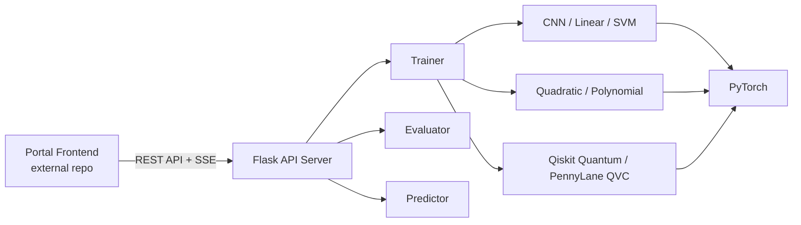

# Multi-Dataset Classifier Platform


An API-only Flask service for training, evaluating, and comparing classical and quantum-hybrid neural network classifiers across multiple datasets. Containerized with Docker and served via gunicorn in production.

> **Note on naming:** The repository directory may still appear as `quantum-protein-kernel` in some contexts — this is a historical artifact. The project is a general-purpose multi-dataset classifier platform (package name: `quantum-machine-learning`). No protein or bioinformatics data is used.

Ships with **MNIST** (handwritten digit recognition from image input) and **Iris** (flower species classification from numeric features), and is designed so adding a new dataset requires zero changes to existing code.

## Architecture


```mermaid
graph LR
    A[Portal Frontend<br/>external repo] -->|REST API + SSE| B[Flask API Server]
    B --> C[Trainer]
    B --> D[Evaluator]
    B --> E[Predictor]
    C --> F[CNN / Linear / SVM]
    C --> G[Quadratic / Polynomial]
    C --> H[Qiskit Quantum / PennyLane QVC]
    F --> I[PyTorch]
    G --> I
    H --> I
```

---

## Features

### Core
- **Plugin architecture** — each dataset is a self-contained plugin; add new ones without modifying any shared code
- **Multiple model architectures per dataset** — CNN, Linear, SVM, Quadratic, Polynomial, and Qiskit quantum models for MNIST; Linear, SVM, and PennyLane QVC for Iris
- **Live training progress** via Server-Sent Events — loss and epoch updates stream as they happen, with synchronous (`/sync`) fallbacks for scripts and CI
- **Training history** — loss and validation-accuracy data points emitted as structured `history` events during training and returned with the final result
- **Auto-evaluation** — test-set accuracy, per-class accuracy, and parameter counts computed on demand
- **Multi-model comparison** — train as many models as you like and compare metrics side-by-side via `GET /d/<dataset>/models`
- **Image prediction** (MNIST) — POST a base64-encoded image and get predictions from every trained model
- **Feature prediction** (Iris) — POST sepal/petal measurements and predict species
- **Model persistence** — export trained models to `.pt` checkpoint files (including training history) and re-import them across sessions

### Advanced Training
- **Early stopping** — halt training when validation accuracy stops improving (configurable patience)
- **Validation monitoring** — periodic validation accuracy checks during training (configurable frequency)
- **Knowledge distillation** — train a student model using a previously trained teacher's soft outputs
- **Custom regularization** — pluggable regularization functions via `TrainingConfig`

### Advanced Evaluation
- **Ensemble evaluation** — majority-vote ensemble across multiple models with logit-based tie-breaking
- **Ablation study** — zero out each layer's parameters and measure the accuracy drop, streamed via SSE
- **Parameter counting** — automatic trainable parameter counts in every training and evaluation result

### Frontend
This repository is **API-only** — it serves no HTML, templates, or static assets (`static_folder=None`). The browser UI (canvas drawing, training curves, comparison tables, theming) lives in the separate portfolio portal repository, which consumes this API over the HTTP + SSE contract documented below and enforced by the live-HTTP contract tests in `tests/contract/`.

---

## Quick Start

### Docker (recommended)

The container runs gunicorn against the production WSGI entry point (`classifiers.wsgi:app`) and listens on `$PORT` (default **8080**; the image `EXPOSE`s 8080). The image also installs the quantum extras (PennyLane, Qiskit, Qiskit Aer), so all model types are available.

```bash
git clone https://github.com/andypeterson2/quantum-machine-learning.git
cd quantum-machine-learning
docker build -t qml-classifiers .
docker run --rm -p 8080:8080 qml-classifiers
```

Or with Docker Compose (`CLASSIFIER_PORT` selects the host port mapping; use 8080 to match the container's listen port):

```bash
CLASSIFIER_PORT=8080 docker compose up --build
```

Verify it's up:

```bash
curl http://localhost:8080/health
```

### Local

#### 1. Install dependencies

```bash
pip install -r requirements.txt
```

(That includes `flask`, `flask-cors`, `mistune`, `torch`, `torchvision`, `numpy`, `Pillow`, `scikit-learn`, and `gunicorn`. For a GPU-enabled torch build, install `torch`/`torchvision` manually first — see the comments in `requirements.txt`.)

**Optional** — for the quantum model architectures:

```bash
pip install qiskit qiskit-aer   # MNIST Qiskit-CNN / Qiskit-Linear
pip install "pennylane<0.45"    # Iris QVC (0.45+ needs numpy>=2, incompatible with torch 2.2)
```

#### 2. Run the server

```bash
CLASSIFIERS_PORT=5001 python -m classifiers
```

If `CLASSIFIERS_PORT` is not set, the dev server picks a **random free port** and logs it at startup (`Running on http://localhost:<port>`). There is no `GET /` route — check the service with:

```bash
curl http://localhost:5001/health
curl http://localhost:5001/api        # discovery index of every endpoint
```

MNIST data is downloaded automatically to `./data/` on first run (~11 MB).
Iris data is loaded from scikit-learn (bundled, no download needed).

#### 3. Train a model

Stream progress over SSE:

```bash
curl -N -X POST http://localhost:5001/d/mnist/train \
  -H "Content-Type: application/json" \
  -d '{"model_type": "CNN", "epochs": 3, "batch_size": 64, "lr": 0.001, "name": "My CNN"}'
```

Or train synchronously (no SSE client needed — the response body is the final result):

```bash
curl -X POST http://localhost:5001/d/mnist/train/sync \
  -H "Content-Type: application/json" \
  -d '{"model_type": "Linear", "epochs": 1}'
```

Optional fields configure early stopping, validation frequency, and knowledge distillation (see [Advanced Training Options](#advanced-training-options)).

#### 4. Evaluate and predict

```bash
# Evaluate every trained model (synchronous variant)
curl -X POST http://localhost:5001/d/mnist/evaluate/sync

# Predict with every trained Iris model
curl -X POST http://localhost:5001/d/iris/predict \
  -H "Content-Type: application/json" \
  -d '{"features": {"sepal_length": 5.1, "sepal_width": 3.5, "petal_length": 1.4, "petal_width": 0.2}}'
```

#### 5. Save and load models

```bash
# Export a trained model to ./models/ as a .pt checkpoint
curl -X POST http://localhost:5001/d/mnist/models/My%20CNN/export

# List and re-import saved checkpoints
curl http://localhost:5001/d/mnist/models/disk
curl -X POST http://localhost:5001/d/mnist/models/disk/<filename>/load
```

---

## Project Layout

```
quantum-machine-learning/
├── classifiers/                    # Application package
│   ├── __init__.py                 # Package docstring
│   ├── __main__.py                 # Dev entry point  (python -m classifiers)
│   ├── wsgi.py                     # Production WSGI entry (gunicorn classifiers.wsgi:app)
│   ├── server.py                   # Flask app factory (API-only) + CORS + DI setup
│   ├── connections.py              # ConnectionTracker (SSE heartbeat client registry)
│   ├── dataset_plugin.py           # DatasetPlugin ABC (the OCP extension point)
│   ├── plugin_registry.py          # Plugin discovery + registration
│   ├── base_model.py               # BaseModel ABC (forward + loss_fn)
│   ├── trainer.py                  # Training loop (early stopping, distillation, history)
│   ├── training_config.py          # TrainingConfig + HistoryEntry dataclasses
│   ├── evaluator.py                # Evaluation (single, ensemble, ablation)
│   ├── predictor.py                # Inference pipeline (raw input → probabilities)
│   ├── model_registry.py           # In-memory model store, namespaced by dataset
│   ├── persistence.py              # Disk I/O for .pt checkpoint files
│   ├── web_export.py               # Browser weight exporter (make export-web) — trains the
│   │                               #   Linear models via the real plugins/Trainer, stamps provenance
│   ├── losses.py                   # Shared loss functions (hinge loss)
│   ├── layers.py                   # Reusable layers (Quadratic, Polynomial)
│   ├── qiskit_layers.py            # Qiskit quantum circuit layer (optional dep)
│   ├── types.py                    # Shared types (StatusCallback, TrainingEvent)
│   ├── LAYERS.md                   # Custom-layer documentation
│   ├── routes/
│   │   ├── __init__.py             # Blueprint registration
│   │   ├── main.py                 # GET /health, GET /api, GET /api/datasets[...]
│   │   ├── connection_routes.py    # GET /connect (SSE heartbeat), POST /pong, /disconnect
│   │   ├── dataset_routes.py       # /d/<dataset> blueprint shell + plugin-resolution hooks
│   │   ├── train_routes.py         # POST /train (SSE) + POST /train/sync
│   │   ├── eval_routes.py          # POST /evaluate(/sync), /ensemble, /ablation
│   │   ├── model_routes.py         # /predict, /models CRUD, /model-info, export, disk
│   │   ├── errors.py               # Centralized error_response() helper
│   │   └── sse.py                  # SSE streaming helpers
│   └── datasets/
│       ├── __init__.py             # Auto-discovery trigger
│       ├── mnist/
│       │   ├── __init__.py         # Register MNISTPlugin
│       │   ├── plugin.py           # MNISTPlugin (loaders, preprocessing, config)
│       │   ├── models.py           # MNISTNet, LinearNet, SVMNet, Quadratic,
│       │   │                       #   Polynomial, QiskitCNN, QiskitLinear
│       │   └── MODELS.md           # Per-model docs served by /model-info
│       └── iris/
│           ├── __init__.py         # Register IrisPlugin
│           ├── plugin.py           # IrisPlugin (sklearn data, standardisation)
│           ├── models.py           # IrisLinear, IrisSVM, IrisQVC
│           └── MODELS.md           # Per-model docs served by /model-info
├── tests/                          # Pytest suite (438 test functions)
│   └── contract/                   # Live-HTTP contract tests + JSON schemas
├── docs/                           # Architecture, API, and model reference
├── exports/web/                    # Browser-served linear weights for the portfolio site
│                                   #   (committed; drift-checked by tests/test_web_export.py)
├── notebooks/qsvm-iris/            # QSVM paper recreation (Yang et al. 2019) — executed
│                                   #   notebook, own venv, `make export-site` renders it to
│                                   #   CSP-clean HTML for the portfolio site's AI/ML page
├── models/                         # Saved .pt checkpoints (git-ignored)
└── data/                           # Dataset cache (git-ignored)
```

---

## Architecture & Design Principles

The codebase follows all five [SOLID](https://en.wikipedia.org/wiki/SOLID) principles:

### Single Responsibility (SRP)

Each module has one clear job:

| Module | Responsibility |
|--------|---------------|
| `trainer.py` | Training loop only — no data loading, no evaluation |
| `training_config.py` | Training configuration dataclasses — no logic |
| `evaluator.py` | Test-set metrics only — no training, no I/O |
| `predictor.py` | Single-sample inference only — delegates preprocessing to the plugin |
| `model_registry.py` | In-memory model storage — no file I/O |
| `persistence.py` | Disk checkpoint I/O — no in-memory state |
| `layers.py` | Reusable neural network layers — no model assembly |
| `connections.py` | SSE heartbeat client tracking — no route handling |
| `train_routes.py` | HTTP orchestration for training — delegates to `Trainer` |
| `eval_routes.py` | HTTP orchestration for evaluation — delegates to `Evaluator` |
| `model_routes.py` | HTTP orchestration for model CRUD — delegates to registry/persistence |
| `errors.py` | Consistent JSON error response formatting |
| `sse.py` | SSE frame formatting and streaming — no business logic |

### Open/Closed (OCP)

The `DatasetPlugin` ABC is the sole extension point. Adding a new dataset (e.g. Fashion-MNIST, CIFAR-10) means creating a new subpackage under `classifiers/datasets/` — **zero changes to any existing file**. Auto-discovery (`pkgutil.walk_packages`) finds and registers it at startup.

Similarly, new model architectures are added by defining a `BaseModel` subclass and registering it in the plugin's `get_model_types()` — the trainer, evaluator, and routes handle them automatically.

### Liskov Substitution (LSP)

All `DatasetPlugin` subclasses and all `BaseModel` subclasses are fully interchangeable. The shared infrastructure (trainer, evaluator, predictor, routes) works identically regardless of which concrete plugin or model is active. Models can override `loss_fn()` (e.g. SVM uses hinge loss instead of cross-entropy) without breaking any consumer.

### Interface Segregation (ISP)

- `BaseModel` exposes only `forward()` and `loss_fn()` — no training or evaluation methods
- `DatasetPlugin` groups only dataset-specific concerns — no route handling or persistence logic
- `StatusCallback` is a minimal single-method type alias, not a heavy interface
- `TrainingEvent` is a lightweight Protocol for structured SSE events
- `TrainingConfig` is an opt-in dataclass — when `None`, the trainer behaves identically to its original simple loop

### Dependency Inversion (DIP)

Route handlers never import concrete services directly. Instead, shared services (`ModelRegistry`, `ModelPersistence`, `ConnectionTracker`) are attached to `app.extensions` during factory setup and accessed via `current_app.extensions[...]` at request time. This makes each component independently testable and replaceable.

The trainer depends on the `DataLoader` abstraction (not concrete dataset libraries), and the evaluator depends on `BaseModel` (not specific architectures). Qiskit is lazy-imported only when a quantum model is instantiated — the rest of the codebase has no awareness of it.

---

## Adding a New Dataset

To add a third dataset (e.g. Fashion-MNIST), create a subpackage:

```
classifiers/datasets/fashion_mnist/
├── __init__.py       # 2 lines: import + register_plugin()
├── plugin.py         # FashionMNISTPlugin(DatasetPlugin)
└── models.py         # Model architectures for this dataset
```

### `__init__.py`

```python
from classifiers.plugin_registry import register_plugin
from .plugin import FashionMNISTPlugin

register_plugin(FashionMNISTPlugin())
```

### `plugin.py`

```python
from classifiers.dataset_plugin import DatasetPlugin

class FashionMNISTPlugin(DatasetPlugin):
    name = "fashion_mnist"
    display_name = "Fashion-MNIST"
    input_type = "image"
    num_classes = 10
    class_labels = ["T-shirt", "Trouser", "Pullover", "Dress", "Coat",
                    "Sandal", "Shirt", "Sneaker", "Bag", "Ankle boot"]
    image_size = (28, 28)
    image_channels = 1

    def get_train_loader(self, batch_size): ...
    def get_test_loader(self, batch_size): ...
    def get_val_loader(self, batch_size): ...   # Optional: enables early stopping
    def preprocess(self, raw_input): ...
    def get_model_types(self): ...
```

That's it. No changes to any existing file. The new dataset appears automatically in `GET /api/datasets`, with its own scoped routes under `/d/fashion_mnist/` and its own UI configuration at `/api/datasets/fashion_mnist/config`.

---

## API Reference

Full request/response shapes are in [docs/api.md](docs/api.md). Machine-readable schemas live in `tests/contract/schemas/`, and `GET /api` returns a live discovery index of every endpoint.

### Top-level

| Method | Path | Body | Response |
|--------|------|------|----------|
| `GET` | `/health` | — | `{status, service, version, uptime_s, uptime, clients, timestamp}` |
| `GET` | `/api` | — | Discovery index: `{service, version, endpoints, streaming}` |
| `GET` | `/api/datasets` | — | `[{name, display_name, input_type}, ...]` |
| `GET` | `/api/datasets/<name>/config` | — | `{ui_config, model_types}` |

### Connection lifecycle

| Method | Path | Body | Response |
|--------|------|------|----------|
| `GET` | `/connect` | — | SSE stream: `welcome` event (`client_id`, `heartbeat_interval`), then periodic `ping` events |
| `POST` | `/pong` | `{client_id}` | `204` (heartbeat acknowledged) or `404` |
| `POST` | `/disconnect` | `{client_id}` | `204` (graceful teardown) |

### Dataset-scoped (`/d/<dataset>/`)

| Method | Path | Body | Response |
|--------|------|------|----------|
| `POST` | `/d/<dataset>/train` | `{model_type, epochs, batch_size, lr, name, patience?, val_gap?, teacher?, distill_weight?}` | SSE stream |
| `POST` | `/d/<dataset>/train/sync` | same as `/train` | JSON: final training result |
| `POST` | `/d/<dataset>/evaluate` | `{}` | SSE stream |
| `POST` | `/d/<dataset>/evaluate/sync` | `{}` | `{results: {name: {accuracy, avg_loss, per_class_accuracy, num_params}}}` |
| `POST` | `/d/<dataset>/ensemble` | `{model_names: ["Model 1", "Model 2", ...]}` | JSON result |
| `POST` | `/d/<dataset>/ablation` | `{model_name: "Model 1"}` | SSE stream |
| `POST` | `/d/<dataset>/predict` | `{image: "<b64>"}` or `{features: {...}}` | `{results: {name: {prediction, confidence, probs}}}` |
| `GET` | `/d/<dataset>/models` | — | `{name: {model_type, epochs, ..., eval_result}}` |
| `GET` | `/d/<dataset>/model-info/<type>` | — | `{html}` (rendered MODELS.md section) |
| `DELETE` | `/d/<dataset>/models/<name>` | — | `{ok: true}` |
| `POST` | `/d/<dataset>/models/<name>/export` | — | `{ok: true, filename}` |
| `GET` | `/d/<dataset>/models/disk` | — | `[{filename, name, model_type, ...}]` |
| `POST` | `/d/<dataset>/models/disk/<fn>/load` | — | `{ok: true, name, model_type, ...}` |

### Streaming vs. sync

Training and evaluation stream progress over Server-Sent Events; each streaming route has a synchronous REST equivalent (`/train/sync`, `/evaluate/sync`) that runs the same work to completion and returns the final result directly — every operation is reachable with plain `curl`, no SSE client required.

### SSE Event Format

Training, evaluation, and ablation routes stream newline-delimited JSON events:

```
data: {"type": "status", "msg": "Epoch 1/3 - loss: 0.312"}\n\n
data: {"type": "history", "epoch": 1, "batch": 50, "train_loss": 0.312, "val_accuracy": 0.95}\n\n
data: {"type": "ablation_result", "layer": "conv1", "accuracy": 0.11, "drop": 0.87}\n\n
data: {"type": "done", "name": "CNN", "model_type": "CNN", "history": [...], ...}\n\n
data: {"type": "error", "msg": "..."}\n\n
```

### Advanced Training Options

The `/train` and `/train/sync` endpoints accept optional fields for advanced training:

| Field | Type | Default | Description |
|-------|------|---------|-------------|
| `patience` | `int` | — | Early stopping patience (epochs without improvement) |
| `val_gap` | `int` | `50` | Batches between validation checks |
| `teacher` | `string` | — | Name of a trained model to use as distillation teacher |
| `distill_weight` | `float` | `0.5` | Blend weight: `(1-w)*true_loss + w*distill_loss` |

---

## Model Architectures

### MNIST

| Architecture | Description | Typical Accuracy |
|-------------|-------------|-----------------|
| **CNN** (`MNISTNet`) | 2-layer ConvNet: Conv→ReLU→Conv→ReLU→Pool→FC→FC | ~99% |
| **Linear** (`LinearNet`) | Logistic regression: Flatten→Linear(784→10) | ~92% |
| **SVM** (`SVMNet`) | Linear layer + multi-class hinge loss | ~91-92% |
| **Quadratic** (`MNISTQuadraticNet`) | CNN backbone + quadratic expansion layer | ~98-99% |
| **Polynomial** (`MNISTPolynomialNet`) | CNN backbone + polynomial (log-linear-exp) layers | ~98-99% |
| **Qiskit-CNN** (`QiskitCNN`) | CNN backbone + Qiskit quantum circuit layer | varies* |
| **Qiskit-Linear** (`QiskitLinear`) | Linear backbone + Qiskit quantum circuit layer | varies* |

\* Qiskit models require `qiskit` and `qiskit-aer` to be installed. They only appear in the dataset's `model_types` when these packages are available. Training is significantly slower due to quantum circuit simulation.

### Iris

| Architecture | Description | Typical Accuracy |
|-------------|-------------|-----------------|
| **Linear** (`IrisLinear`) | Single linear layer: Linear(4→3) | ~95-97% |
| **SVM** (`IrisSVM`) | Linear layer + multi-class hinge loss | ~94-96% |
| **QVC** (`IrisQVC`) | PennyLane quantum variational classifier (4 qubits, 2 layers) | ~93-96%* |

\* QVC requires `pennylane` to be installed. It only appears in the dataset's `model_types` when PennyLane is available.

### Custom Layers

| Layer | Module | Description |
|-------|--------|-------------|
| `Quadratic` | `layers.py` | Quadratic expansion: `y = W * concat(x^T * x, x)` |
| `Polynomial` | `layers.py` | Polynomial basis: `y = exp(W * log(\|x\| + 1))` |
| `QiskitQLayer` | `qiskit_layers.py` | Multi-headed trainable parametric quantum circuit with finite-difference gradients |

---

## Running Tests

```bash
python -m pytest tests/ -v
```

The test suite (438 test functions) covers:
- Model construction and forward pass for all architectures
- Training loop with status callbacks, early stopping, and history tracking
- Single-model evaluation, ensemble evaluation, and ablation studies
- Prediction pipeline with plugin-delegated preprocessing
- Model registry (CRUD, dataset isolation, eval result storage)
- Checkpoint persistence (save/load including training history)
- All Flask routes via `app.test_client()` (train, evaluate, ensemble, predict, model management)
- CORS behaviour and documentation accuracy checks

`tests/contract/` additionally holds live-HTTP contract tests (run against a booted server with JSON-schema validation) that pin the API surface the portal frontend depends on; CI runs them in a dedicated job.

---

## Configuration

All configuration is via environment variables:

| Setting | Env var | Default | Read in |
|---------|---------|---------|---------|
| Dev server port | `CLASSIFIERS_PORT` | random free port (logged at startup) | `classifiers/__main__.py` |
| Dev server host | `CLASSIFIERS_HOST` | `127.0.0.1` | `classifiers/__main__.py` |
| Debug mode (dev server) | `CLASSIFIERS_DEBUG` | on for `python -m classifiers`; `0` in the container | `classifiers/__main__.py` |
| Container port (gunicorn) | `PORT` | `8080` | `Dockerfile` CMD |
| Allowed CORS origins | `CLASSIFIERS_CORS_ORIGINS` | `http://localhost:*,https://andypeterson.dev` | `classifiers/server.py` |
| Max request body size | `CLASSIFIERS_MAX_CONTENT_LENGTH` | 2 MB | `classifiers/server.py` |
| Gateway origin guard | `ORIGIN_SECRET` | unset (guard inactive) | `classifiers/server.py` |
| Checkpoint directory | — | `./models/` | `classifiers/server.py` |
| MNIST data directory | — | `./data/` | `classifiers/datasets/mnist/plugin.py` |

---

## Dependencies

| Package | Purpose |
|---------|---------|
| `torch` | Model definition, training, inference |
| `torchvision` | MNIST dataset + transforms |
| `flask` | Web server and routing |
| `flask-cors` | CORS headers for the cross-origin portal frontend |
| `mistune` | Markdown rendering for the `/model-info` endpoint |
| `pillow` | Image preprocessing (base64 PNG → tensor) |
| `numpy` | Array operations and softmax probabilities |
| `scikit-learn` | Iris dataset loader |
| `gunicorn` | Production WSGI server (container) |
| `qiskit` | *(optional)* Quantum circuit definition for Qiskit models |
| `qiskit-aer` | *(optional)* Quantum circuit simulation backend |
| `pennylane` | *(optional)* Quantum variational classifier for Iris |

---

## Tech Stack

**Backend:** Python 3.12, PyTorch 2.2, Flask 3.0, NumPy, Pillow, scikit-learn
**Serving:** gunicorn (single worker, threaded) in Docker; Werkzeug dev server locally
**Infrastructure:** Docker, GitHub Actions CI (4 jobs: unit tests, live-HTTP contract tests, ruff lint, Docker build)
**Quantum:** Qiskit (MNIST), PennyLane (Iris) — both optional

---

## License

This project is licensed under the MIT License — see [LICENSE](LICENSE) for details.
